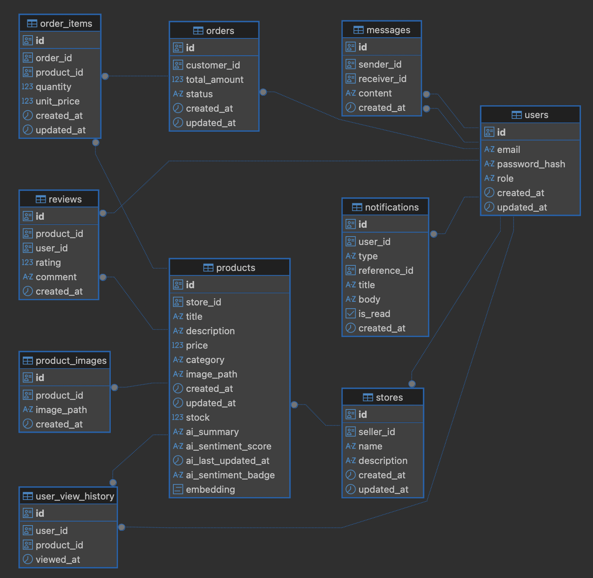

# 🚀 Drewisy: Yapay Zeka Odaklı Yeni Nesil E-Ticaret Backend Mimarisi

Bu proje, 11 günlük bir hackathon maratonunda tek bir mühendis tarafından uçtan uca tasarlanmış, **Clean Architecture** prensiplerini benimseyen, **Yapay Zeka (AI)** ve **Gerçek Zamanlı (Real-time)** yeteneklerle donatılmış bir e-ticaret altyapısıdır.

Sistem, monolitik bir yapıda olmasına rağmen asenkron işleyiş (Background Workers), olay güdümlü iletişim (Redis Pub/Sub & Message Queues) ve vektörel arama (pgvector) gibi modern mimari pattern'leri içerir.

## 🛠 1. Teknoloji Yığını ve Mimari

- **Dil / Core:** Go (Golang) 1.25
- **Framework:** Echo (Yüksek performanslı REST & WebSocket routing)
- **Veritabanı:** PostgreSQL 15 + `pgvector` (RAG ve Semantik arama için)
- **Önbellek & Kuyruk:** Redis 7 (Stok rezervasyonu, Sipariş Kuyruğu, Rate Limiting, Pub/Sub)
- **Yapay Zeka:** Google Gemini API (Metin üretimi, Intent parsing, Vektör oluşturma, Akışlı sohbet)
- **Mimari:** Clean Architecture (Domain, Usecase, Repository, Delivery)
- **Altyapı:** Docker & Docker Compose

## 🎯 2. MVP Özellikleri (Ruthless Prioritization)

Hackathon kısıtları göz önüne alınarak sistem 3 ana ayağa oturtulmuştur:

1. **Ölçeklenebilir Core E-Ticaret:** Güvenilir stok düşümü, asenkron sipariş işleme mekanizması (Redis Queue + DLQ), Rol bazlı yetkilendirme (Admin, Seller, Customer).
2. **AI Destekli Akıllı Asistan (RAG):** Müşterinin incelediği son ürünleri bağlam (context) olarak alıp, stoktaki ürünlerle eşleştirerek **WebSocket üzerinden gerçek zamanlı (Stream)** alışveriş danışmanlığı yapan akıllı asistan.
3. **Semantik Arama ve Satıcı Zekası:** `pgvector` HNSW indeksleri kullanılarak geleneksel LIKE sorguları yerine anlamsal (Cosine Similarity) arama. Satıcılar için AI tarafından üretilen finansal "Dashboard" özetleri.

## 🗄️ 3. Veritabanı Şeması (Core Entities)

Sistem ilişkisel bir model üzerine inşa edilmiş olup, ağır AI sorguları için indekslerle optimize edilmiştir.



- **`users`**: Kimlik yönetimi ve RBAC (Role-Based Access Control).
- **`stores` & `products`**: `products` tablosu `embedding vector(768)` kolonu barındırır. Hızlı semantik arama için HNSW indeksi ile donatılmıştır.
- **`orders` & `order_items`**: Müşteri ve mağaza arasındaki ticari bağ.
- **`reviews` & `user_view_history`**: Kullanıcının izlediği ürünler (`user_view_history`) AI kişiselleştirmesi için, yorumlar ise AI duygu analizi (Sentiment Badge) için asenkron olarak işlenir.
- **`messages` & `notifications`**: WebSocket üzerinden anlık iletilen birebir iletişim ve bildirim altyapısı.

## ⚙️ 4. Kritik Mühendislik ve Sistem Tasarım Kararları

### Sipariş Yönetimi (Reliable Queue & Eventual Consistency)

Siparişler doğrudan veritabanına yazılmaz. Kullanıcı "Satın Al" dediğinde:

1. Redis üzerinden `DECRBY` ile atomic stok rezervasyonu yapılır.
2. Sipariş paketi `order_queue` kuyruğuna (Redis LPUSH) atılır ve kullanıcıya hızlıca "İşleniyor" yanıtı dönülür.
3. Arka planda çalışan `Order Worker`, güvenli okuma (`BLMOVE`) ile siparişi alır, PostgreSQL Transaction'ı başlatır ve kaydeder. Hata olursa `Dead Letter Queue (DLQ)` mekanizması devreye girer.

### AI Operasyonlarının İzolasyonu

AI çağrıları yavaş olabileceğinden sistemin ana damarlarından izole edilmiştir:

- **On-Demand AI:** Arama niyetini anlama (Intent Parsing) ve Ürün açıklaması yazdırma işlemleri Cache (Redis) destekli senkron çalışır.
- **Batch AI (Gece Vardiyası):** Müşteri yorumlarını okuyup özet çıkaran ve ürün vektörlerini güncelleyen sistem, günde bir kez arka planda `Goroutine Worker Pool` ile (rate limit uygulanarak) çalışır.
- **WebSocket Streaming:** AI asistan cevapları HTTP üzerinden beklenmez, parçalar halinde (Chunk) WebSocket üzerinden client'a akıtılır.

### Dosya Yükleme Stratejisi (Cloud-Native Storage & Presigned URLs)

Ürün görsellerinin yüklenmesi sunucuya (Backend'e) yük bindirmemelidir. Sistem, AWS S3 mimarisine uyumlu tasarlanmıştır. Frontend, dosyayı doğrudan backend'e göndermek yerine, önce backend'den geçici bir yükleme izni (**Presigned URL**) alır ve dosyayı doğrudan depolama alanına yükler. Bu sayede backend bant genişliği korunur ve RAM darboğazları (OOM) önlenir.

### Güvenlik ve API Koruma (Security & Resilience)

- **Kimlik Doğrulama:** Stateless JWT (JSON Web Token) kullanılmıştır.
- **RBAC (Role-Based Access Control):** Custom middleware'ler ile `Admin`, `Seller` ve `Customer` rolleri uç nokta (endpoint) bazında izole edilmiştir. Satıcılar IDOR zafiyetlerine karşı korunmuş olup, sadece kendi mağazalarındaki ürün ve siparişlere müdahale edebilir.
- **Rate Limiting:** Kötü niyetli saldırıları ve AI (Gemini) API kotalarının sömürülmesini engellemek için kritik uç noktalara In-Memory Rate Limiter (Örn: 10 istek/sn) uygulanmıştır.

## 📄 5. API Sözleşmeleri (Contract Standard)

Tüm REST endpoint'leri Frontend'in işini kolaylaştırmak adına katı bir JSON standart wrapper'ı kullanır. API detayları, uç noktaları ve tasarımlar iOS tarafındaki dokümantasyon ve ekran görüntüleri ile detaylandırılmıştır.

Sistem genelinde kabul edilen standart başarılı yanıt (Response) formatı şu temel prensiplere dayanır:

- **`success`:** İşlemin sonucunu belirten kesin (boolean) bayrak.
- **`data`:** İşlem sonucunda dönen dinamik veri bloğu.
- **`code`:** İlgili HTTP statü kodu (örn: 200, 201).

_Hata durumlarında `data` objesi yerine `error` objesi dönülerek, istemci (Client) tarafında güvenli ve merkezi bir hata yakalama mekanizması (Error Handling) sağlanmıştır._

## 🚀 6. Kurulum ve Çalıştırma

Proje `docker-compose` ile tamamen konteynerize edilmiştir. Tek komutla tüm altyapı (Go Backend, PostgreSQL+pgvector, Redis) ayağa kalkar.

1. Kök dizinde bir `.env` dosyası oluşturun ve aşağıdaki kritik yapılandırmaları tanımlayın:

```env
# Veritabanı ve Önbellek
DB_HOST=db
DB_PORT=5432
DB_USER=postgres
DB_PASSWORD=secret
DB_NAME=drewisy
DB_SSLMODE=disable

REDIS_HOST=redis
REDIS_PORT=6379

# Güvenlik
JWT_SECRET=super-secret-hackathon-key

# Yapay Zeka
GEMINI_API_KEY=senin-gemini-api-anahtarin

# Storage (Lokal veya S3)
USE_S3=false
# USE_S3=true ise AWS_REGION ve AWS_BUCKET değişkenlerini de ekleyin.
```

2. Servisleri başlatın:

```bash
docker-compose up --build -d
```
